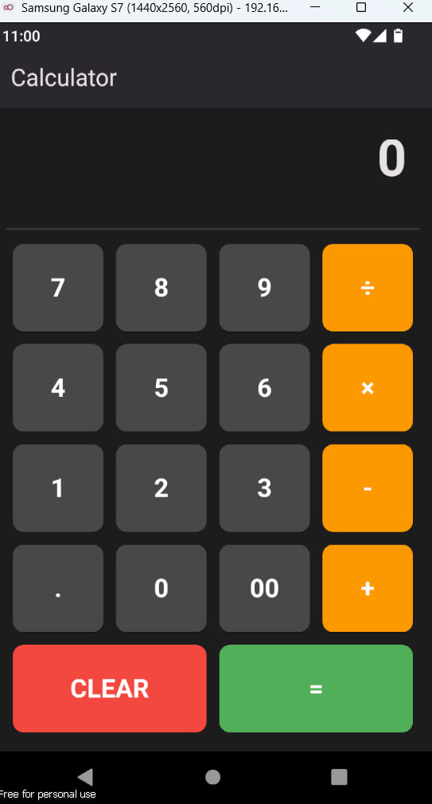

# Calculator APP:

Welcome to Calculator App, a sleek and user-friendly application designed to handle all your basic arithmetic operations with ease. Built using Flutter, this app not only performs standard calculations such as addition, subtraction, multiplication, and division, but it also features an appealing dark-themed interface that enhances usability and visual appeal.

## How to Run:
To run this, 
- Install code editors from [Here](https://code.visualstudio.com/download)
- Install Flutter from [Here](https://docs.flutter.dev/get-started/install) 
- Install android studio from [Here](https://developer.android.com/studio) 

- Clone above repository in any folder 
- Start the Android studio emulator ,You can you external emulator as well to run this project. (don't forget to connect the emulator with your code. you can simply do it from 1: VSCode, 2: command palette, 3: flutter:select device, and choose your device/emulator)
- open that folder in VSCode 

- Open command prompt and run following command to check is everything is ok with flutter?
```https 
  flutter doctor
``` 
- if everything is ok, Run following command to run flutter app
```https
  flutter run 

```

- Now you can see few todo lists, if they car not usable for you, you can delete them and add other todo list as per your requirements.

 

## Output :


### Feedback

If you have any feedback, please reach out to me at yogendrabaskota18@gmail.com 


